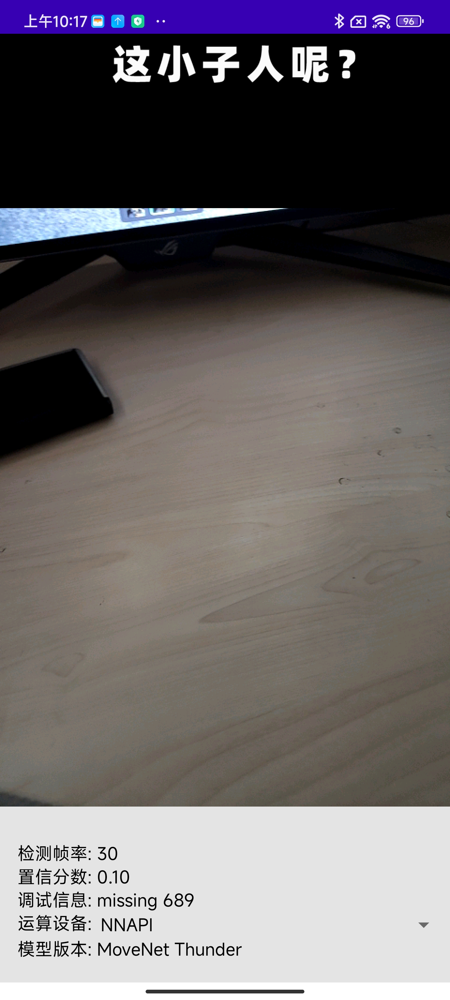
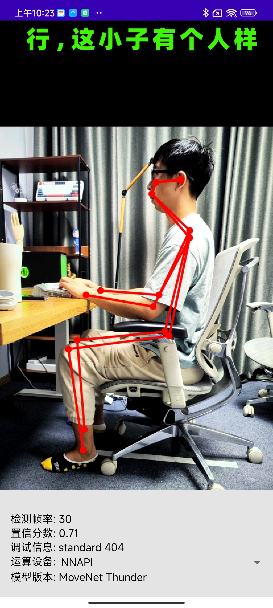
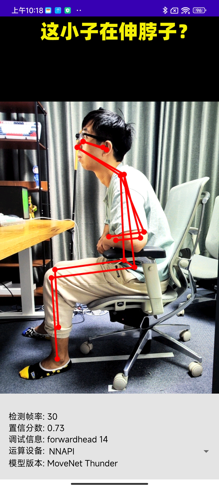
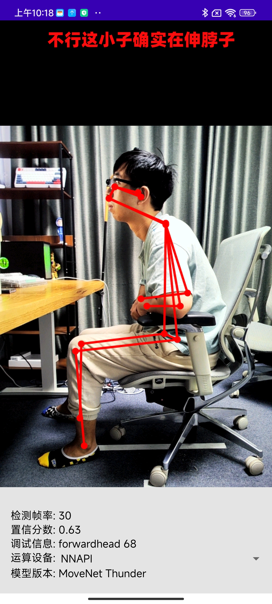

# PoseMon 让爷康康

<image align="right" src="doc_images/screenshot_icon.jpg" alt="Application Icon" width=17%>

“让爷康康”是一款应用于安卓平台的手机应用，可以实时监测不良坐姿并给出语音提示。本项目主要基于 [Tensorflow Lite 官方示例 - 姿态估计](https://github.com/tensorflow/examples/tree/master/lite/examples/pose_estimation/android)实现，其中 AI 部分包含用于姿态估计的 [MoveNet](https://blog.tensorflow.org/2021/05/next-generation-pose-detection-with-movenet-and-tensorflowjs.html)，以及用于对姿态进行分类的[全连接网络](https://github.com/tensorflow/tensorflow/blob/master/tensorflow/lite/g3doc/tutorials/pose_classification.ipynb)。本应用不需要联网使用，所有 AI 特性均在手机本地运行，不需要将视频画面传输至外部服务器，仅需要摄像头权限用于获取姿态画面。视频介绍可以点击 [bilibili]() 或 [YouTube]()。

## 在 Android Studio 中编译程序并运行

### 准备工作

* 安卓项目的编译需要 Android Studio，可以进入[官方网站](
 https://developer.android.com/studio/install?hl=zh-cn)按照说明进行下载安装。

* 需要准备一部安卓手机。

### 编译程序

* 通过 `git clone` 克隆本项目，或者以压缩包形式下载项目文件并解压。

* 打开 Android Studio，在初始的 `Welcome` 界面选择
`Open an existing Android Studio project`，打开项目中的安卓工程文件夹。

* 安卓工程文件位于本项目的 `android/` 文件夹下。在 Android Studio 的提示窗口中选择该文件夹。项目打开后软件可能会提示需要进行 Gradle 同步，同意并等待同步完成即可。

* 将处于开发者模式的手机通过 USB 线连接到电脑，具体连接方法可以参考[官方教程](https://developer.android.com/studio/run/device?hl=zh-cn)。如果程序顶部工具栏右侧正确显示了你的手机型号，说明设备连接成功。

* 如果是首次安装 Android Studio，可能还需要安装一系列开发工具。点击软件界面右上角的绿色三角按钮`Run 'app'`直接运行程序。如果有需要安装的工具，系统会进行提示，按照提示依次安装即可。

## 模型介绍

本项目需要用到两个神经网络模型文件，均已包含在本项目中，不需要额外下载。第一个是 `int8` 格式的 MoveNet Thunder 神经网络模型，可以点击[官方模型文件链接](https://tfhub.dev/google/lite-model/movenet/singlepose/thunder/tflite/int8/4)进一步了解。[MoveNet](https://blog.tensorflow.org/2021/05/next-generation-pose-detection-with-movenet-and-tensorflowjs.html) 是谷歌推出的轻量级人体姿态估计模型，有 Thunder 和 Lightning 两个版本。其中 Thunder 版本运行速度较慢，但准确率更高，本项目使用的是 Thunder 版本。该版本又分为 `float16`、`int8` 两种数据格式。其中 `float16` 模型只能在通用 GPU 上运行，而 `int8` 模型既可以运行于通用 GPU 之上，也可以在高通骁龙处理器的 [Hexagon DSP 数字信号处理器](https://developer.qualcomm.com/software/hexagon-dsp-sdk/dsp-processor)上运行。运行在 Hexagon 处理器上时，AI 程序运行速度更快、也更省电，建议对 AI 模型进行移动部署时优先选择 Hexagon 处理器。目前谷歌也推出了自研的 Google Tensor 处理器，最新型号为 Tensor G2，如何调用 Tensor 处理器的 AI 加速单元尚不清楚，未来拿到设备实测确认后会更新文档。

### 训练自己的分类网络

<image align="right" src="doc_images/labeled_movenet_result.png" alt="17 Keypoints detected by MoveNet" width=25%>

除了 MoveNet Thunder，本项目还使用了一个简单的全连接网络对 MoveNet 输出的姿态信息（人体 17 个关键点的坐标）进行分类，用来判断画面中的人处于“标准坐姿”、“翘二郎腿”、“脖子前倾驼背”中的哪一种状态。关于该分类网络的介绍以及训练过程实际演示，可以参考 Tensorflow Lite 的 [Jupyter Notebook 教程](https://github.com/tensorflow/tensorflow/blob/master/tensorflow/lite/g3doc/tutorials/pose_classification.ipynb)，或是本项目中修改并注释过的[版本]()。本项目为了对“标准坐姿”、“翘二郎腿”、“脖子前倾驼背”三种姿态进行分类，为每种姿态采集了约 300 张照片作为训练集（共 876 张照片），为每种姿态采集了约 30 张作为测试集（共 74 张照片）。其中训练集与测试集为不同人物主体，以此来在训练过程中及时发现模型的过拟合问题。训练数据应存放于 `main/pose_data/train/` 路径下的 `standard`、`crossleg`、`forwardhead` 
三个文件夹中，测试数据则位于 `main/pose_data/test/` 路径下。本项目中用于训练分类网络的 [Jupyter Notebook]() 会将原始数据自动转化为训练数据包，在此过程中生成每张照片的 MoveNet 检测结果，并将每张照片标记为三种姿态中的一种，最后将所有信息存储在 `main/pose_data/train_data.csv`、`main/pose_data/test_data.csv`，并生成记录标签信息的文本文件 `main/pose_data/pose_labels.txt`。在 Notebook 中训练完毕后，在 `main/pose_data/` 路径下会自动生成 `.tflite` 权重文件，导入至 Android Studio 项目中，替换掉本项目中的 `android\app\src\main\assets\classifier.tflite` 即可使用。

## 运行效果

将手机连接至电脑，Android Studio 可以对本项目进行编译并将 App 安装至手机。打开应用，授权使用相机后，App 便可以监测人体坐姿并根据实时检测结果给出语音提示。程序的显示界面主要分为上、中、下三部分，顶部显示 AI 对当前姿态的判断结果，中部为摄像头实时画面，底部为信息显示界面，其中“运算设备”一栏可以选择不同选项，使用 CPU、GPU 或 NNAPI（Hexagon AI 加速器）进行计算，其中 NNAPI 速度最快，也最省电。为了避免程序误报，App 加入了一系列判断逻辑以提高 Precision（精确率）。连续 30 帧出现不健康坐姿时，程序会进入警戒状态，此时如果接下来 30 帧画面同样均判定为不健康坐姿，程序才会发出语音提示。效果如图所示：

<table width="100%">
 <tr>
  <td width="25%" style="line-height:0;"></td>
  <td width="25%" style="line-height:0;"></td>
  <td width="25%" style="line-height:0;"></td>
  <td width="25%" style="line-height:0;"></td>
 </tr>
<table>

## 鸣谢
本项目主要基于 [Tensorflow Lite Pose Estimation 示例项目](https://github.com/tensorflow/examples/tree/master/lite/examples/pose_estimation/android)，离不开 [Tensorflow](https://www.tensorflow.org/?hl=zh-cn)、[Jupyter Notebook](https://jupyter.org/) 等开源框架、开源开发工具。感谢各位程序工作者对开源社区的贡献！